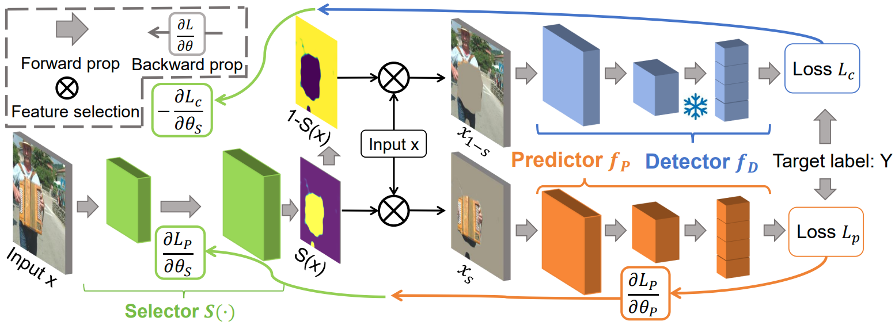
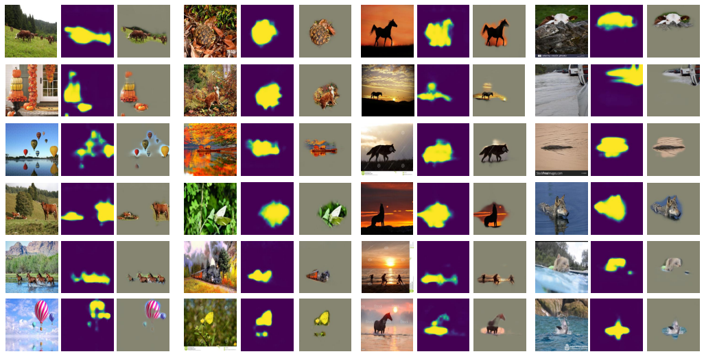

# COMET: 

Code for ECCV 2024:
Comprehensive Attribution: Inherently Explainable Vision Model with Feature Detector
https://arxiv.org/abs/2407.19308


## Framework


## Attribution Maps


## Training

```bash
bash scripts/COMET.sh
```
## Test checkpoint
```bash
bash scripts/COMET_eval.sh
```

## ImageNet9 Training Data

I noticed that the original author's training data link is broken. I've uploaded a new one here:
https://drive.google.com/drive/folders/1I7mYRSLxvf-wNpP-EohJde8RjJmcmO1a?usp=sharing

## Acknowledgement
This repo is modified from [CaaM](https://github.com/Wangt-CN/CaaM). We sincerely thank them for their contributions. We also thank authors of [ImageNet9](https://github.com/MadryLab/backgrounds_challenge) and [NICO++](https://github.com/xxgege/NICO-plus) datasets.
